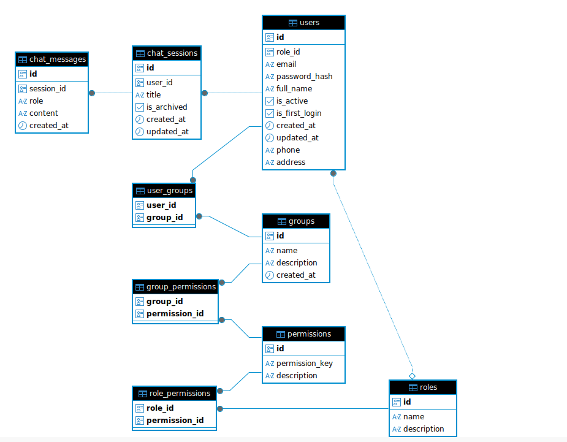
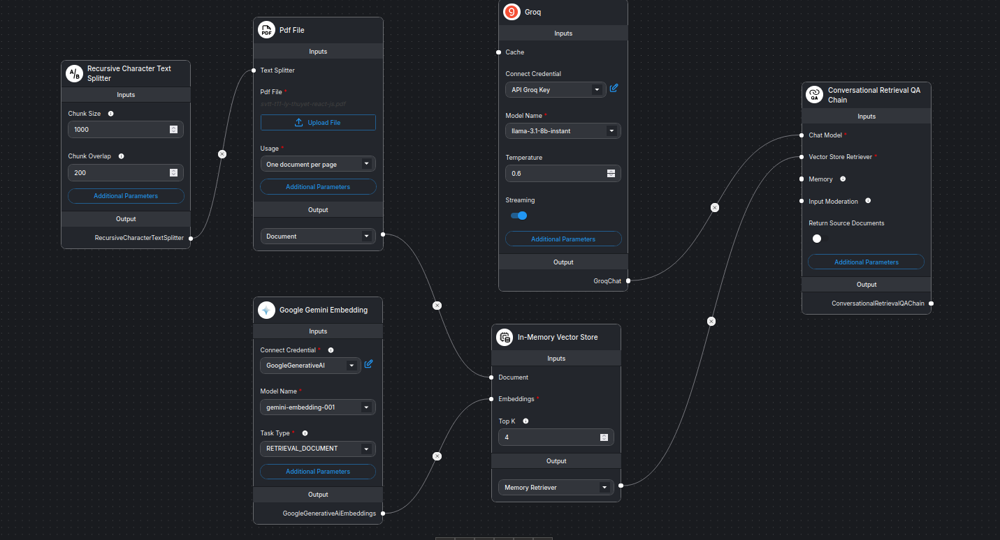

# MiniAgentHub (Neural Hub)

MiniAgentHub là một hệ thống trợ lý ảo AI (Chatbot) nội bộ. Hệ thống cho phép người dùng giao tiếp với các mô hình AI linh hoạt (như Llama 3 hoặc Data Analyst), tích hợp quản lý người dùng, phân quyền chi tiết (RBAC - Role Based Access Control) và quản lý nhóm làm việc.

Dự án được chia làm 2 phân hệ chính:
- **Frontend**: Giao diện người dùng được xây dựng bằng React.
- **Backend**: Máy chủ API được xây dựng bằng Node.js / Express.

---

## Tính năng nổi bật

### 1. Trợ lý AI Đa mô hình
- **Llama 3 (Groq)**: Trò chuyện đa năng, phản hồi siêu tốc độ thông qua Groq API.
- **Data Analyst (Flowise)**: Trợ lý chuyên biệt để phân tích dữ liệu, truy vấn database và xử lý file CSV.
- Khả năng lưu trữ và tiếp nối ngữ cảnh (Session-based chat) cho từng cuộc trò chuyện.

### 2. Quản lý hệ thống & Phân quyền
- **Authentication**: Đăng nhập, bảo mật phiên làm việc với JSON Web Token (JWT).
- **RBAC Authorization**: Kiểm soát quyền truy cập chi tiết thông qua Role và Permission (VD: `USER_R`, `CONV_D`).
- **Group Management**: Tạo nhóm, gán người dùng vào nhóm và phân quyền theo cấp độ nhóm.

### 3. Trải nghiệm người dùng (UX/UI)
- Giao diện Chat hiện đại, hỗ trợ render Markdown (Code block, Table, List).
- Hỗ trợ giao diện **Sáng (Light) / Tối (Dark)**.
- Đa ngôn ngữ (i18n), hỗ trợ sẵn Tiếng Việt.
- Tự động cuộn, quản lý lịch sử trò chuyện dễ dàng.

---

## Công nghệ sử dụng

### Frontend (`MiniAgentHub-Frontend`)
- **Framework**: React.js (Vite)
- **State Management**: Zustand (`authStore`, `themeStore`)
- **Styling**: Tailwind CSS & Lucide React (Icons)
- **Routing**: React Router DOM
- **Markdown Rendering**: `react-markdown`, `rehype-raw`
- **Network**: Axios (với interceptors xử lý Token tự động)

### Backend (`MiniAgentHub-Backend`)
- **Môi trường & Framework**: Node.js, Express.js
- **Database & ORM**: PostgreSQL (hoặc MySQL) giao tiếp qua **Sequelize**
- **Authentication**: `jsonwebtoken` (JWT), mã hóa mật khẩu (bcrypt)
- **AI Integration**: Axios gọi API từ **Flowise** & **Groq**

---

## Sơ đồ hệ thống & Cơ sở dữ liệu

### 1. Database Schema (Cấu trúc CSDL)



### 2. Sơ đồ luồng Flowise (Data Analyst)



### 3. Quyết định Thiết kế CSDL (Design Decisions)

- **Tách biệt `chat_sessions` và `chat_messages`:**
  Thay vì gộp chung, việc chia thành 2 bảng (quan hệ 1-N) giúp tối ưu tốc độ tải giao diện (Sidebar chỉ cần query tiêu đề Session thay vì quét hàng ngàn tin nhắn), tránh lặp dữ liệu và giúp cô lập ngữ cảnh (Context) chính xác cho từng phiên chat của AI.
- **Cấu trúc phân quyền (Fine-grained RBAC):**
  Thay vì thiết kế đơn giản chỉ dùng 3 bảng (`Role`, `Group`, `GroupToUser`) đòi hỏi phải viết chết quyền hạn trong source code (hardcode), hệ thống sử dụng cấu trúc phân quyền hạt mịn với các bảng trung gian (`Permission`, `RolePermission`, `GroupPermission`). Điều này cho phép **cấu hình quyền động (Dynamic)** đến từng thao tác chi tiết (Create, Read, Update, Delete) trực tiếp từ Database/UI mà không cần sửa code hay deploy lại server.

  *Ví dụ minh họa:*
  - Bảng `Permission` định nghĩa sẵn các quyền rời rạc như: `USER_C` (Tạo User), `USER_R` (Xem User), `USER_D` (Xóa User).
  - Vai trò (Role) **Admin** được map với cả 3 quyền trên, trong khi Role **User** chỉ có quyền `USER_R`.
  - Nếu có yêu cầu: *"Cho phép nhóm **Trưởng phòng** được quyền xóa User"*. Bạn chỉ cần dùng giao diện UI gán quyền `USER_D` cho nhóm này (lưu xuống `GroupPermission`). Code backend `checkPermission('USER_D')` sẽ tự động cho phép người dùng thuộc nhóm Trưởng phòng thực hiện thao tác xóa mà bạn không cần phải sửa lại mã nguồn (như `if (role === 'Admin' || group === 'Trưởng phòng')`) hay khởi động lại server.

---

## � Cấu trúc thư mục

```text
MiniAgentHub/
├── MiniAgentHub-Backend/         # Source code server, REST API
│   ├── src/
│   │   ├── controllers/          # Xử lý logic API (aiController, userController, ...)
│   │   ├── middleware/           # Middleware bảo mật, xác thực quyền (authMiddleware)
│   │   ├── models/               # Định nghĩa các Schema CSDL (ChatSession, ChatMessage, Group...)
│   │   ├── services/             # Logic nghiệp vụ trung tâm (aiService, userService, groupService)
│   │   └── ...
│   └── package.json
│
├── MiniAgentHub-Frontend/        # Source code giao diện UI
│   ├── src/
│   │   ├── components/           # Các component dùng chung (Sidebar, Modal, ...)
│   │   ├── locales/              # File cấu hình ngôn ngữ i18n (vi.json, ...)
│   │   ├── pages/                # Các trang chính (Dashboard, Login, Settings)
│   │   ├── services/             # Cấu hình gọi API (axiosClient)
│   │   ├── store/                # Trạng thái toàn cục (Zustand)
│   │   └── App.jsx               # Routing chính của ứng dụng
│   └── package.json
│
└── README.md                     # Tài liệu dự án
```

---

## ⚙️ Hướng dẫn cài đặt và khởi chạy

### 1. Cài đặt Backend

1. Di chuyển vào thư mục backend:
   ```bash
   cd MiniAgentHub-Backend
   ```
2. Cài đặt các thư viện:
   ```bash
   npm install
   ```
3. Cấu hình biến môi trường:
   - Copy file `.env.example` và đổi tên thành `.env` (`cp .env.example .env`).
   - Các cấu hình cơ bản (`PORT`, `DATABASE_URL`, `JWT_SECRET`) đã được thiết lập giả định để dự án có thể chạy được ngay. Hãy đảm bảo bạn có PostgreSQL và sửa lại `DATABASE_URL` cho khớp với máy của bạn.
   - **Lưu ý:** Các key AI (`GROQ_API_KEY`, `FLOWISE_API_URL`) là **tùy chọn**. Nếu chưa có, bạn cứ để trống. Bạn vẫn có thể đăng nhập vào trải nghiệm UI bình thường, hệ thống chỉ yêu cầu key khi bạn bắt đầu Chat.
4. Khởi tạo CSDL và các Bảng (Quan trọng khi chạy lần đầu):
   - Mở công cụ quản lý Database (như pgAdmin, DBeaver) và tạo một Database trống. Đảm bảo tên Database khớp với cấu hình trong chuỗi `DATABASE_URL`.
   - Khởi chạy server lần đầu tiên để ORM (Sequelize) tự động nạp và tạo các bảng vào Database:
     ```bash
     npm run dev
     ```
   - Đợi đến khi terminal báo chạy thành công và kết nối Database ổn định, nhấn tổ hợp phím `Ctrl + C` để tắt server.
5. Khởi tạo dữ liệu mặc định (Seeding):
   - Tiếp tục chạy lệnh dưới đây để hệ thống nạp sẵn các phân quyền mặc định và tài khoản Admin:
   ```bash
   npm run seed
   ```
   *Lệnh này sẽ tự động tạo tài khoản quản trị hệ thống mặc định:*
   - **Email:** `admin@agenthub.com`
   - **Mật khẩu:** `Admin@123`
6. Chạy server chính thức:
   ```bash
   npm run dev
   ```

### 2. Cài đặt Frontend

1. Di chuyển vào thư mục frontend:
   ```bash
   cd ../MiniAgentHub-Frontend
   ```
2. Cài đặt thư viện:
   ```bash
   npm install
   ```
3. Cấu hình biến môi trường:
   - Copy file `.env.example` và đổi tên thành `.env`.
   - Mặc định biến `VITE_API_URL=http://localhost:3000/api` đã được cấu hình sẵn để gọi xuống Backend nội bộ.
4. Khởi chạy giao diện (Vite):
   ```bash
   npm run dev
   ```

---

## Lưu ý
- Trong quá trình sử dụng Flowise cho mô hình "Data Analyst", hãy chắc chắn rằng địa chỉ `FLOWISE_API_URL` được cấu hình trỏ đúng đến REST API Endpoint thay vì URL giao diện HTML.
