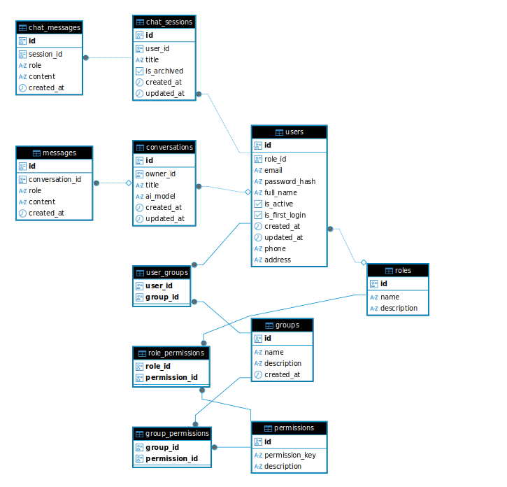

# MiniAgentHub (Neural Hub)

MiniAgentHub là một hệ thống trợ lý ảo AI (Chatbot) nội bộ. Hệ thống cho phép người dùng giao tiếp với các mô hình AI linh hoạt (như Llama 3 hoặc Data Analyst), tích hợp quản lý người dùng, phân quyền chi tiết (RBAC - Role Based Access Control) và quản lý nhóm làm việc.

Dự án được chia làm 2 phân hệ chính:
- **Frontend**: Giao diện người dùng được xây dựng bằng React.
- **Backend**: Máy chủ API được xây dựng bằng Node.js / Express.

---

## Tính năng nổi bật

### 1. Trợ lý AI Đa mô hình
- **Llama 3 (Groq)**: Trò chuyện đa năng, phản hồi siêu tốc độ thông qua Groq API.
- **Data Analyst (Flowise)**: Trợ lý chuyên biệt để phân tích dữ liệu, truy vấn database và xử lý file CSV.
- Khả năng lưu trữ và tiếp nối ngữ cảnh (Session-based chat) cho từng cuộc trò chuyện.

### 2. Quản lý hệ thống & Phân quyền
- **Authentication**: Đăng nhập, bảo mật phiên làm việc với JSON Web Token (JWT).
- **RBAC Authorization**: Kiểm soát quyền truy cập chi tiết thông qua Role và Permission (VD: `USER_R`, `CONV_D`).
- **Group Management**: Tạo nhóm, gán người dùng vào nhóm và phân quyền theo cấp độ nhóm.

### 3. Trải nghiệm người dùng (UX/UI)
- Giao diện Chat hiện đại, hỗ trợ render Markdown (Code block, Table, List).
- Hỗ trợ giao diện **Sáng (Light) / Tối (Dark)**.
- Đa ngôn ngữ (i18n), hỗ trợ sẵn Tiếng Việt.
- Tự động cuộn, quản lý lịch sử trò chuyện dễ dàng.

---

## Công nghệ sử dụng

### Frontend (`MiniAgentHub-Frontend`)
- **Framework**: React.js (Vite)
- **State Management**: Zustand (`authStore`, `themeStore`)
- **Styling**: Tailwind CSS & Lucide React (Icons)
- **Routing**: React Router DOM
- **Markdown Rendering**: `react-markdown`, `rehype-raw`
- **Network**: Axios (với interceptors xử lý Token tự động)

### Backend (`MiniAgentHub-Backend`)
- **Môi trường & Framework**: Node.js, Express.js
- **Database & ORM**: PostgreSQL (hoặc MySQL) giao tiếp qua **Sequelize**
- **Authentication**: `jsonwebtoken` (JWT), mã hóa mật khẩu (bcrypt)
- **AI Integration**: Axios gọi API từ **Flowise** & **Groq**

---

## Sơ đồ hệ thống & Cơ sở dữ liệu

### 1. Database Schema (Cấu trúc CSDL)



### 2. Sơ đồ luồng Flowise (Data Analyst)


---

## � Cấu trúc thư mục

```text
MiniAgentHub/
├── MiniAgentHub-Backend/         # Source code server, REST API
│   ├── src/
│   │   ├── controllers/          # Xử lý logic API (aiController, userController, ...)
│   │   ├── middleware/           # Middleware bảo mật, xác thực quyền (authMiddleware)
│   │   ├── models/               # Định nghĩa các Schema CSDL (ChatSession, ChatMessage, Group...)
│   │   ├── services/             # Logic nghiệp vụ trung tâm (aiService, userService, groupService)
│   │   └── ...
│   └── package.json
│
├── MiniAgentHub-Frontend/        # Source code giao diện UI
│   ├── src/
│   │   ├── components/           # Các component dùng chung (Sidebar, Modal, ...)
│   │   ├── locales/              # File cấu hình ngôn ngữ i18n (vi.json, ...)
│   │   ├── pages/                # Các trang chính (Dashboard, Login, Settings)
│   │   ├── services/             # Cấu hình gọi API (axiosClient)
│   │   ├── store/                # Trạng thái toàn cục (Zustand)
│   │   └── App.jsx               # Routing chính của ứng dụng
│   └── package.json
│
└── README.md                     # Tài liệu dự án
```

---

## ⚙️ Hướng dẫn cài đặt và khởi chạy

### 1. Cài đặt Backend

1. Di chuyển vào thư mục backend:
   ```bash
   cd MiniAgentHub-Backend
   ```
2. Cài đặt các thư viện:
   ```bash
   npm install
   ```
3. Cấu hình biến môi trường:
   Tạo file `.env` từ `.env.example` (nếu có) và thiết lập các biến như `DB_URL`, `JWT_SECRET`, `FLOWISE_API_URL`, `GROQ_API_KEY`.
4. Chạy server:
   ```bash
   npm run dev
   ```

### 2. Cài đặt Frontend

1. Di chuyển vào thư mục frontend:
   ```bash
   cd ../MiniAgentHub-Frontend
   ```
2. Cài đặt thư viện:
   ```bash
   npm install
   ```
3. Khởi chạy giao diện (Vite):
   ```bash
   npm run dev
   ```
   *Lưu ý: Đảm bảo có file `.env` chứa `VITE_API_URL` trỏ về địa chỉ server Backend.*

---

## Lưu ý
- Trong quá trình sử dụng Flowise cho mô hình "Data Analyst", hãy chắc chắn rằng địa chỉ `FLOWISE_API_URL` được cấu hình trỏ đúng đến REST API Endpoint thay vì URL giao diện HTML.
